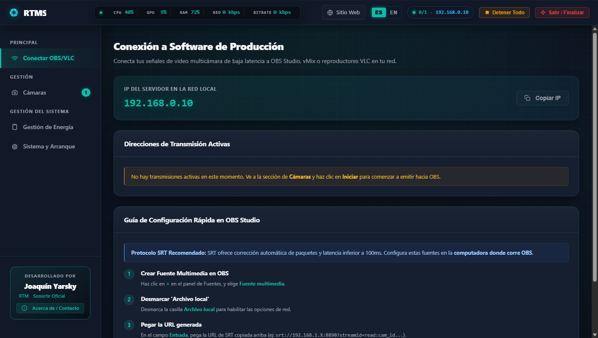
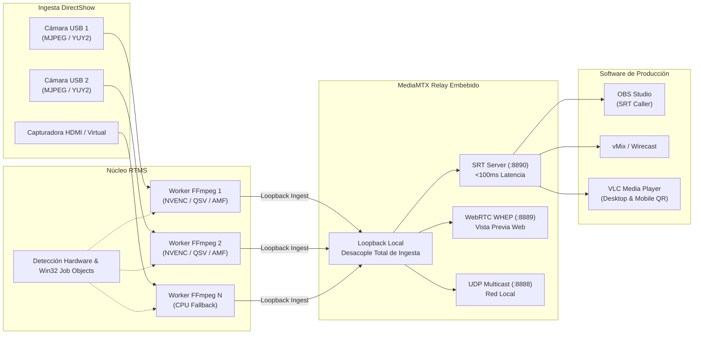

<div align="center">


<p align="center">
  <a href="https://github.com/FJYarsky/RTMS/releases/latest">
    
  </a>
</p>

[](https://github.com/FJYarsky/RTMS/releases/latest)
[](https://fjyarsky.github.io/RTMS/)
[](https://microsoft.com)
[](https://www.srtalliance.org/)
[](#-seguridad)
[](SECURITY.md)
[](https://github.com/FJYarsky/RTMS/actions/workflows/ci.yml)
[](https://github.com/FJYarsky/RTMS/discussions)
[](LICENSE)
[](mailto:joaquinyarsky@gmail.com)

**Servidor de video multicámara de baja latencia para Windows con ingesta desacoplada vía MediaMTX, SRT y UDP.**

[⬇️ Descargar Última Versión](https://github.com/FJYarsky/RTMS/releases/latest) • [Sitio Web Oficial](https://fjyarsky.github.io/RTMS/) • [Capturas](#-demostración-y-capturas-de-pantalla) • [Inicio Rápido](#-inicio-rápido) • [Configuración OBS](#-configuración-en-obs-studio) • [Características](#-características) • [Seguridad](#-seguridad) • [Discusiones](https://github.com/FJYarsky/RTMS/discussions) • [Contacto](#-contacto-y-soporte)

---

</div>

## 📌 Descripción

**RTMS (Real-Time Multicam System)** es una estación de transmisión para Windows diseñada para capturar dispositivos DirectShow (cámaras web USB, capturadoras HDMI USB/PCIe y cámaras virtuales) y centralizar su distribución de **baja latencia (<100 ms)** hacia **OBS Studio**, **vMix** o **VLC Media Player**.

Integra un servidor de medios embebido (**MediaMTX**) que desacopla la ingesta de la distribución, garantizando que las conexiones o desconexiones de clientes receptores nunca reinicien la cámara física. Cuenta con telemetría en tiempo real, persistencia transaccional ACID en SQLite WAL, blindaje de procesos a nivel de kernel mediante Windows Job Objects y cifrado criptográfico local con Windows DPAPI.

> [!TIP]
> 🌐 **Descarga Directa y Documentación**: Visita **[fjyarsky.github.io/RTMS](https://fjyarsky.github.io/RTMS/)** o descarga el zip portable oficial desde **[GitHub Releases](https://github.com/FJYarsky/RTMS/releases/latest)**.

---

## 📸 Interfaz y Arquitectura del Sistema

<div align="center">



</div>

### 🔄 Pipeline de Transmisión e Ingesta Desacoplada



---

## ⚡ Inicio Rápido

### Opción 1: Ejecutable Portable Oficial (Recomendado)

Descarga el paquete `.zip` oficial de la última versión desde **[GitHub Releases](https://github.com/FJYarsky/RTMS/releases/latest)**, descomprímelo en cualquier carpeta y ejecuta directamente `rtms.exe`. No requiere instalación previa de Python ni privilegios de administrador.

### Opción 2: Ejecución desde Código Fuente (Entorno de Desarrollo)
```bash
# 1. Clonar el repositorio
git clone https://github.com/FJYarsky/RTMS.git
cd RTMS

# 2. Instalar dependencias de producción
pip install -r requirements.txt

# 3. Descargar binarios verificados de FFmpeg y MediaMTX (PowerShell)
powershell -ExecutionPolicy Bypass -File scripts/setup_binaries.ps1

# 4. Iniciar la aplicación
python main.py
```

---

## 📺 Configuración en OBS Studio y VLC

### En OBS Studio:
1. Agrega una **Fuente multimedia** (`Media Source`) a tu escena.
2. **Desmarca** la casilla `Archivo local`.
3. En **Entrada** (`Input`), pega la URL copiada desde el panel de RTMS:
   ```text
   srt://192.168.1.X:8890/?streamid=read:CAM_ID
   ```
4. En **Formato de entrada** (`Input Format`), escribe:
   ```text
   mpegts
   ```
5. En **Tiempo de búfer de red**, configura `50 ms` para baja latencia. Haz clic en **Aceptar**.

### En VLC Media Player (Baja Latencia):
- **Desktop (Windows/Mac/Linux)**: Menú *Medio > Abrir emisión de red*, ingresa la URL de la cámara y en opciones avanzadas configura `:network-caching=150`.
- **VLC Mobile (Android / iOS)**: Abre la pestaña *Red*, pulsa *Abrir dirección de red*, escanea el código QR desde el botón **"Compartir enlace | QR"** de RTMS y reproduce en tu red local.

---

## 🚀 Características Principales

- **Ingesta Desacoplada (MediaMTX Relay)**: La cámara física emite continuamente en loopback local. OBS o vMix pueden conectarse y desconectarse cientos de veces sin reiniciar FFmpeg ni provocar parpadeos en los sensores USB.
- **Transmisión de Baja Latencia**: Optimización de pipelines con GOP determinista (500 ms), `-fflags nobuffer -flags low_delay` y VBV sub-segundo para retardo de transporte mínimo.
- **Aceleración por GPU Dedicada**: Detección automática y soporte optimizado para **NVIDIA NVENC** (`h264_nvenc`), **Intel QSV** (`h264_qsv`) y **AMD AMF** (`h264_amf`), con fallback limpio a CPU (`libx264`).
- **Blindaje a Nivel Kernel (Win32 Job Objects)**: Todos los subprocesos multimedia (`ffmpeg.exe`, `ffplay.exe`, `mediamtx.exe`) se asocian a un Job Object con `KILL_ON_JOB_CLOSE`, erradicando procesos huérfanos.
- **Persistencia Transaccional ACID (SQLite WAL)**: Gestión robusta de configuraciones con Write-Ahead Logging, prevención de bloqueos Win32 y backups automáticos preventivos.
- **Gobernador Dinámico de Energía**: Conmutación automática al plan de **Alto Rendimiento** de Windows durante streaming activo y restauración del esquema previo al detenerse.
- **Prevención de Saturación del Bus USB**: Negociación forzada de compresión MJPEG en webcams físicas DirectShow, reduciendo el consumo del bus en más del 95% para permitir multicámara en un mismo hub.
- **Telemetría en Vivo de Alto Rendimiento**: Monitor nativo de GPU mediante llamadas ctypes a `nvml.dll` (<1 ms), CPU, memoria RAM y ancho de banda de red en tiempo real.
- **Papelera de Restauración**: Panel para listar y restaurar cámaras eliminadas u ocultadas con un solo clic.

---

## 🛡️ Seguridad Integral

| Mecanismo de Seguridad | Implementación Técnica en RTMS |
| :--- | :--- |
| **Cifrado DPAPI en Reposo** | Contraseñas SRT cifradas en disco mediante `CryptProtectData` de Windows; nunca se almacenan en texto plano. |
| **Sanitización Exhaustiva de Logs** | Filtro `SecretFilter` y expresiones regulares que purgan credenciales y tokens de consola y archivos de registro. |
| **Aislamiento de Tokens (CWE-598)** | Rechazo explícito de tokens por Query String (`?token=`). Autenticación obligatoria por cabecera `X-RTMS-Token` o cookie `rtms_session`. |
| **Cabeceras HTTP Estrictas** | Middleware con `Content-Security-Policy`, `X-Frame-Options: DENY`, `X-Content-Type-Options: nosniff` y `Referrer-Policy`. |
| **Frontera de Red Controlada** | MediaMTX WHEP vinculado a `127.0.0.1` con acceso proxificado y autenticado a través del backend FastAPI. |
| **Escaneo Antivirus Verificado** | Distribuciones analizadas contra más de 70 motores en **VirusTotal** con cero falsos positivos. |

---

## 🏛️ Estructura del Repositorio

```text
RTMS/
├── api/                   # Endpoints REST modulares, dependencias y WebSockets
│   └── routes/            # Subrutas (streams, preview, system, config, health, power)
├── core/                  # Motor multimedia FFmpeg, detección DirectShow, Job Objects y SQLite
├── gui/                   # Interfaz de usuario (SPA, plantillas Jinja2, estilos y assets SVG)
├── docs/                  # Documentación técnica, manuales de usuario y branding
├── scripts/               # Scripts de descarga de binarios, sanitización y auditoría
├── tests/                 # Suite de pruebas automatizadas con pytest (345 tests)
├── config/                # Plantillas y configuraciones locales
├── main.py                # Punto de entrada principal y servidor ASGI
├── run.bat                # Lanzador de consola para Windows
├── pyproject.toml         # Metadatos del proyecto, configuración de linters y build
└── README.md              # Documentación principal
```

---

## 🧪 Control de Calidad y Pruebas

```bash
# Ejecutar la suite completa de pruebas unitarias e integración (345 tests):
pytest tests/ -v

# Verificación de linter y formateo de código con Ruff:
ruff check .
ruff format --check .

# Verificación estricta de tipos estáticos con Mypy:
mypy core/ api/ main.py

# Auditoría integral de salud del repositorio y catálogo canónico:
python scripts/repo_sanitizer.py --strict
```

---

## 👨‍💻 Soporte y Autor

Desarrollado y mantenido por **Joaquín Yarsky**:
- 📧 **Contacto Directo**: [joaquinyarsky@gmail.com](mailto:joaquinyarsky@gmail.com)
- 🌐 **Sitio Web Oficial**: [fjyarsky.github.io/RTMS](https://fjyarsky.github.io/RTMS/)
- 🐙 **Repositorio GitHub**: [github.com/FJYarsky/RTMS](https://github.com/FJYarsky/RTMS)

<div align="center">
  <br>
  <sub>Desarrollado y mantenido con dedicación en Argentina</sub>
</div>

---

## 📄 Licencia

Este proyecto está distribuido bajo la licencia **MIT**. Consulta el archivo [LICENSE](LICENSE) para más detalles. Las licencias y avisos de componentes de terceros se encuentran disponibles en [THIRD_PARTY_NOTICES.md](THIRD_PARTY_NOTICES.md).
