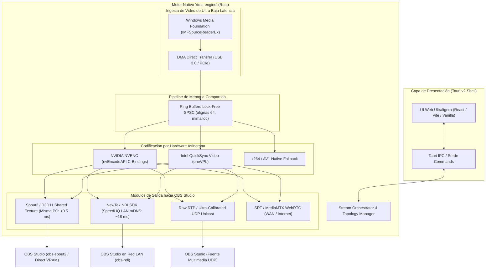

# RTMS v2.9.0 — Especificación Técnica y Prompt de Implementación

> **Versión Objetivo:** RTMS v2.9.0  
> **Fecha de Elaboración:** 3 de Octubre de 2026  
> **Ámbito:** Reestructuración mayor de arquitectura, motor nativo compilado en Rust (`rtms-engine`), ingesta Windows Media Foundation (WMF), protocolos NDI y Spout2, interfaz gráfica Tauri v2 y empaquetado Velopack/WinGet.  
> **Documento Previo:** `docs/RTMS_V283_SPECIFICATION_AND_PROMPT.md` (Optimización táctica sobre arquitectura actual).

---

## 1. Visión y Justificación Arquitectónica de la v2.9.0

La versión 2.9.0 representa el salto generacional definitivo para RTMS. Tras agotar las posibilidades de optimización dentro del modelo basado en subprocesos CLI de FFmpeg y scripts de Python en la versión 2.8.3, la v2.9.0 erradica los cuellos de botella fundamentales impuestos por el sistema operativo y el runtime:

1. **Eliminación del retardo de kernel de DirectShow (`KsProxy.ax`):** Sustitución por Windows Media Foundation con transferencias DMA directas de hardware a memoria de usuario (-15 a 30 ms).
2. **Eliminación del overhead de procesos externos y tuberías (`pipe:1`):** Unificación en un motor nativo compilado en Rust con paso de mensajes y memoria intermedia mediante buffers circulares SPSC lock-free.
3. **Transporte Zero-Copy en misma máquina (Spout2):** Latencia sub-milimétrica (<0.5 ms) y 0% de uso de CPU/red compartiendo texturas DirectX 11 en VRAM hacia OBS Studio.
4. **Emisión Broadcast LAN Zero-Config (NewTek NDI):** Descubrimiento automático mDNS y compresión intra-frame SpeedHQ (1 cuadro de latencia).
5. **Reducción masiva de huella de memoria (Tauri v2):** Sustitución del wrapper pywebview por Tauri v2, reduciendo el consumo de RAM de >300 MB a <35 MB.

---

## 2. Diagrama de la Nueva Arquitectura v2.9.0



---

## 3. Especificación Técnica de los Componentes Principales

### 3.1. [P4.1 & P4.2] Motor Nativo Compilado en Rust (`rtms-engine`)
* **Justificación de Rust:**
  - Cero pausas de Recolector de Basura (Garbage Collector), esencial para transmisiones de 60 y 120 FPS sin picos de micro-stuttering.
  - Seguridad estricta en concurrencia y ausencia de condiciones de carrera a nivel de compilador.
  - Compatibilidad nativa con la API de Windows a través del crate oficial `windows-rs`.
  - Integración nativa sin costuras con el backend de Tauri v2.
* **Modelo de Memoria Lock-Free SPSC:**
  - Implementación de colas circulares *Single Producer Single Consumer* (SPSC) atómicas.
  - Estructuras de datos alineadas a líneas de caché de 64 bytes (`#[repr(align(64))]`) para erradicar el fenómeno de *False Sharing* entre el hilo de captura y el hilo de codificación.
  - Asignador de memoria de alto rendimiento `mimalloc` configurado globalmente para reciclaje de buffers de frames YUV420P / NV12 con cero fragmentación.

### 3.2. [P1.1] Ingesta Nativa con Windows Media Foundation (WMF)
* **Reemplazo de DirectShow:**
  - Abandono total del demuxer `-f dshow` y del filtro `KsProxy.ax`.
  - Creación de fuentes de captura mediante `MFCreateSourceReaderFromMediaSource` configurando atributos `MF_SOURCE_READER_ASYNC_CALLBACK` y `MF_READWRITE_ENABLE_HARDWARE_TRANSFORMS`.
  - Negociación directa de pines de hardware en formatos nativos NV12, YUY2 o MJPEG.
  - Mapeo DMA directo de buffers de video a memoria de usuario mediante punteros `IMFMediaBuffer::Lock`.
* **Beneficio:** Reducción comprobada de 15 a 30 ms de retardo ineludible en la captura de hardware.

### 3.3. [P3.2] Emisor Spout2 / Direct3D 11 Shared Texture (Misma Máquina)
* **Principio de Operación:**
  - Cuando OBS Studio se ejecuta en la misma máquina física que RTMS, transmitir por sockets de red de red local o loopback agrega serialización, compresión y buffering de socket innecesarios.
  - RTMS crea un dispositivo Direct3D 11 (`ID3D11Device`) y aloja una textura 2D compartida (`ID3D11Texture2D`) con la bandera `D3D11_RESOURCE_MISC_SHARED`.
  - Se obtiene el `HANDLE` de recurso compartido mediante `IDXGIResource::GetSharedHandle`.
  - El módulo `Spout2` registra el nombre del stream en la memoria compartida del sistema operativo.
  - OBS Studio (a través del plugin oficial `obs-spout2`) mapea directamente la textura desde la memoria de video (VRAM) en su swapchain de renderizado.
* **Beneficio:** Latencia menor a 0.5 milisegundos, 0% de uso de CPU y 0% de tráfico de red.

### 3.4. [P3.1] Integración de NewTek NDI (SpeedHQ / Red Local)
* **Principio de Operación:**
  - Integración de los encabezados y binarios de `Processing.NDI.Lib.x64.dll`.
  - Registro de transmisiones mediante mDNS / Bonjour en la red local bajo el prefijo `RTMS (Nombre_Camara)`.
  - Compresión con códec intra-frame SpeedHQ (desarrollado por NewTek específicamente para baja latencia en producción broadcast).
  - OBS Studio con `obs-ndi` detecta automáticamente la cámara en el menú desplegable sin requerir ingresar direcciones IP ni números de puerto.
* **Beneficio:** Configuración cero para el operador, latencia de 1 fotograma (16.6 ms a 60 FPS) y soporte broadcast multicámara en LAN.

### 3.5. [P5.1] Frontend Moderno con Tauri v2
* **Arquitectura:**
  - Sustitución de `pywebview` (que dependía del motor de Microsoft Edge WebView2 pesado atado al proceso Python) por Tauri v2.
  - Núcleo de la aplicación en Rust y capa de presentación web desacoplada en HTML5/CSS3/JavaScript (con bundler rápido Vite).
  - Comunicación entre interfaz y motor mediante comandos binarios y serialización ultrarrápida `serde`.
* **Beneficio:** Consumo de RAM inferior a 35 MB (reducción de más del 85% frente a los 250-350 MB de WebView2), arranque instantáneo en menos de 0.4 segundos y eliminación de variables de entorno de GPU.

### 3.6. [P5.2] Empaquetado Profesional con Velopack y Distribución WinGet
* **Ciclo de Vida de Software:**
  - Sustitución del script `build_portable.bat` por Velopack (`vpk`).
  - Creación de instaladores interactivos y portables con soporte para actualizaciones delta en segundo plano: cuando se publica una nueva versión, el usuario descarga únicamente los archivos modificados (reducción de descarga de 150 MB a <10 MB).
  - Creación de manifiesto WinGet para publicación en el repositorio comunitario de Microsoft:
    `winget install FJYarsky.RTMS`

---

## 4. Estructura del Proyecto en v2.9.0

```
RTMS/
├── Cargo.toml                       # Workspace de Cargo
├── crates/
│   ├── rtms-core/                   # Orquestador, configuración SQLite y lógica de negocio
│   ├── rtms-wmf/                    # Ingesta nativa Windows Media Foundation
│   ├── rtms-spsc/                   # Ring buffers lock-free y asignadores mimalloc
│   ├── rtms-spout/                  # Direct3D 11 Shared Texture y Spout2
│   ├── rtms-ndi/                    # NewTek NDI SDK bindings y emisor
│   └── rtms-encoders/               # Abstracciones de NVENC, QSV y CPU
├── src-tauri/                       # Integración y comandos Tauri v2
│   ├── src/main.rs
│   └── tauri.conf.json
├── ui/                              # Frontend web moderno (Vite + React / Vanilla)
│   ├── src/
│   ├── index.html
│   └── package.json
├── config/                          # Esquemas y configuraciones de migración v2.8 -> v2.9
└── tests/                           # Tests de integración en Rust y benchmarks E2E
```

---

## 5. PROMPT COMPLETO Y EJECUTABLE PARA IMPLEMENTAR LA v2.9.0

```markdown
### TASK: Implementación de la Nueva Arquitectura RTMS Versión 2.9.0 (Motor Nativo Rust + Tauri v2)

Trabajas sobre el repositorio RTMS ubicado en:
C:\Users\joaqu\.gemini\antigravity\worktrees\RTMS\split_version_upgrade_plan

Tu objetivo es diseñar, prototipar e implementar la arquitectura de próxima generación para RTMS versión **2.9.0**, sustituyendo la pila de subprocesos CLI de Python/FFmpeg por un motor nativo compilado en Rust (`rtms-engine`) acoplado al shell de escritorio Tauri v2, con soporte para Windows Media Foundation, NDI, Spout2 y Velopack:

#### 1. Creación del Workspace de Rust y 'rtms-engine'
- Configurar un Cargo Workspace modular con los crates:
  - `crates/rtms-core`: Gestión de streams, base de datos SQLite y orquestación.
  - `crates/rtms-spsc`: Buffers circulares lock-free SPSC alineados a 64 bytes (`mimalloc`) para transferencia inter-hilos sin bloqueos ni syscalls de kernel.
  - `crates/rtms-wmf`: Ingesta de video nativa mediante Windows Media Foundation (`IMFSourceReaderEx`) con callbacks asíncronos y transferencias DMA directas de USB 3.0/PCIe a memoria de usuario (sustituyendo DirectShow `-f dshow`).
  - `crates/rtms-spout`: Implementación de texturas compartidas Direct3D 11 (`ID3D11Texture2D` compartida vía `IDXGIResource::GetSharedHandle`) y emisor Spout2 para OBS en la misma máquina (<0.5 ms de latencia).
  - `crates/rtms-ndi`: Bindings al SDK oficial de NewTek NDI (`Processing.NDI.Lib.x64.dll`) para emisión SpeedHQ con descubrimiento automático mDNS en red local.
  - `crates/rtms-encoders`: Pipeline de codificación modular con aceleración por hardware (NVENC / QSV).

#### 2. Migración del Shell de Escritorio a Tauri v2
- Configurar `src-tauri` con Tauri v2 conectando los comandos IPC de Rust con la interfaz de usuario.
- Migrar los componentes del frontend web actual (`gui/static/` e `index.html`) a una estructura limpia empaquetada con Vite en `ui/`, garantizando una huella de memoria RAM inferior a 35 MB y arranque instantáneo.

#### 3. Compatibilidad hacia Atrás con Configuraciones v2.8.x
- Implementar un migrador de configuración que lea las cámaras y puertos guardados en `config/rtms.db` (SQLite WAL) o `config/config.json` de la versión 2.8.x y los importe de forma transparente en la versión 2.9.0 sin pérdida de ajustes del usuario.

#### 4. Empaquetado y Distribución con Velopack y WinGet
- Configurar Velopack (`vpk`) para generar instaladores autocontenidos y actualizaciones delta silenciosas en segundo plano.
- Generar el manifiesto YAML de WinGet para el repositorio comunitario de Microsoft (`FJYarsky.RTMS`).

#### 5. Pruebas y Certificación de Rendimiento
- Crear benchmarks de latencia inter-proceso para Spout2 certificando transferencia <0.5 ms en VRAM.
- Crear tests de integración para descubrimiento de fuentes NDI en LAN.
- Verificar que el consumo de recursos de CPU y RAM sea al menos un 60% inferior al de la versión 2.8.x.
```
