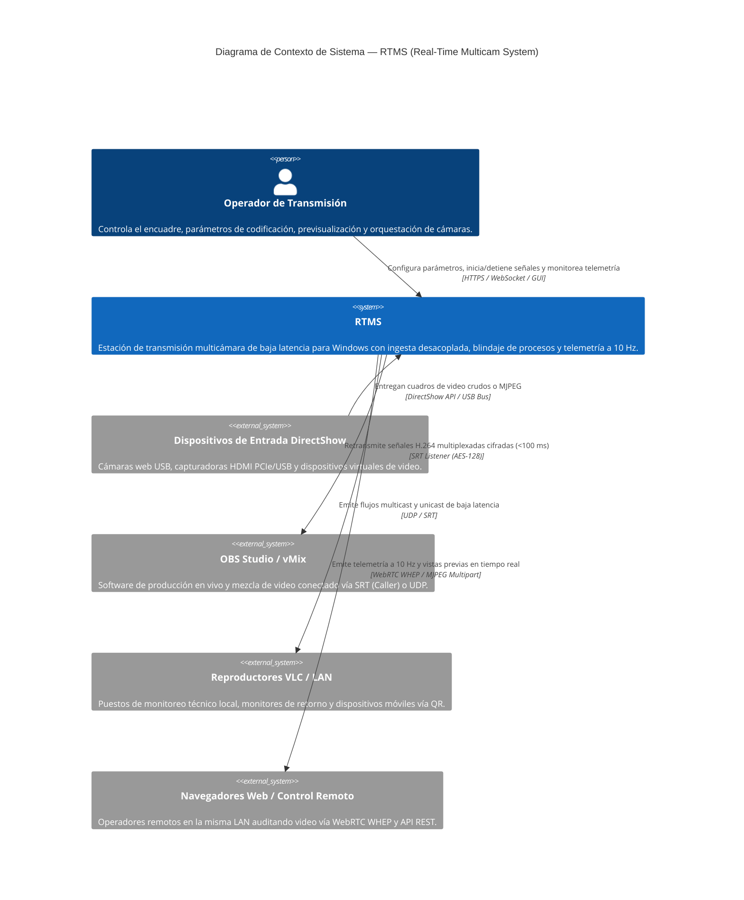
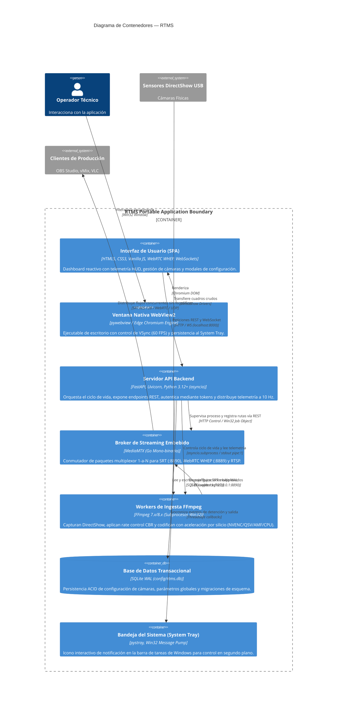
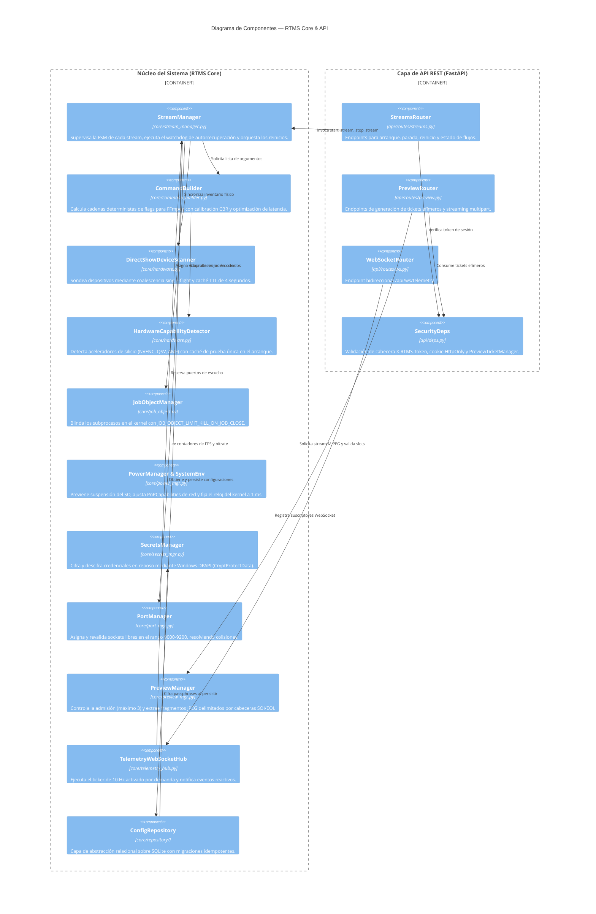
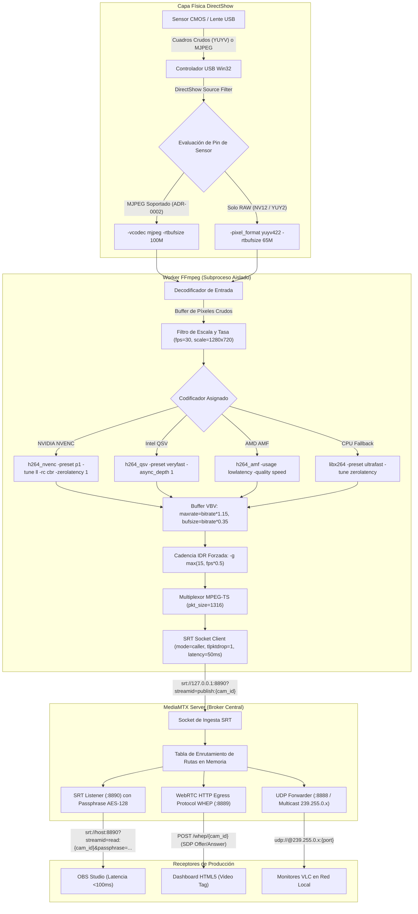

# Arquitectura de Sistema y Vistas C4 de RTMS

* **Versión del Sistema**: RTMS v2.8.0+
* **Estándar Documental**: Modelo C4 (Context, Containers, Components, Code)
* **Autor**: Joaquín Yarsky (<joaquinyarsky@gmail.com>)
* **Clasificación**: Ingeniería de Sistemas de Misión Crítica

---

## 1. Nivel 1: Diagrama de Contexto de Sistema (System Context)

El diagrama de contexto ilustra cómo RTMS interactúa con los operadores humanos, los dispositivos de captura de video físicos del entorno local y los sistemas receptores de producción audiovisual en red.

---

## 2. Nivel 2: Diagrama de Contenedores (Container Diagram)

El diagrama de contenedores desglosa la aplicación RTMS en sus entornos de ejecución, almacenes de datos y procesos concurrentes desacoplados.

---

## 3. Nivel 3: Diagrama de Componentes del Núcleo (Component Diagram)

El diagrama de componentes detalla la estructura modular interna del backend de RTMS y la interacción entre sus administradores especializados.

---

## 4. Nivel 4: Diagrama de Código y Ejecución del Pipeline (Code / Pipeline View)

El diagrama de código modela la secuencia detallada de procesamiento de un cuadro de video desde su captura en el sensor USB hasta su entrega final al cliente SRT.

