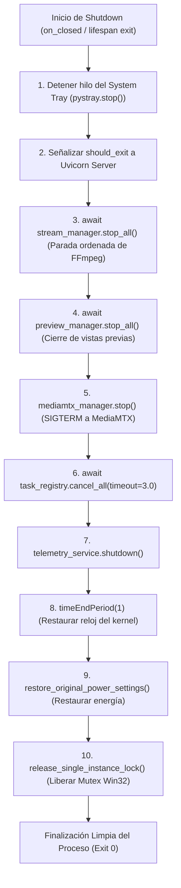

# Modelo de Concurrencia, Hilos y Sincronización de RTMS

* **Versión del Sistema**: RTMS v2.8.0+
* **Autor**: Joaquín Yarsky (<joaquinyarsky@gmail.com>)
* **Área**: Concurrencia / Sistemas Operativos / IPC / Resiliencia

---

## 1. Topología y Jerarquía de Hilos del Sistema

RTMS opera bajo un modelo de concurrencia híbrido que combina programación reactiva asíncrona no bloqueante (`asyncio`), hilos de ejecución nativos del sistema operativo (`threading.Thread`) y aislamiento de subprocesos a nivel de kernel mediante Win32 Job Objects.

```text
[ Proceso Principal: rtms.exe / python.exe (PID: N) ]
├── Thread 0 (Main Thread): Win32 GUI Loop / Edge WebView2 (pywebview)
│     └── Intercepta eventos de ventana (WM_CLOSE -> hide to tray), bombea mensajes de Chromium.
├── Thread 1 (Daemon Thread): Servidor HTTP/WebSocket (Uvicorn / FastAPI)
│     └── Aloja el bucle de eventos principal de asyncio (ProactorEventLoop en Windows).
│           ├── Corrutina: Watchdog Supervisor de Streams (cada 2s)
│           ├── Corrutina: Ticker de Telemetría WebSocket a 10 Hz (On-Demand)
│           ├── Corrutina: Sondeo Periódico de Hotplug DirectShow
│           └── Tareas de I/O de red de la API REST
├── Thread 2 (Daemon Thread): System Tray Native Loop (pystray)
│     └── Ejecuta el bombeo síncrono de mensajes Win32 para el icono de la bandeja del sistema.
└── Thread Pool (concurrent.futures.ThreadPoolExecutor)
      └── Ejecuta operaciones I/O bloqueantes del SO (reglas de firewall, consultas de registro winreg).

[ Subprocesos Hijos en el Kernel (Aislados en Win32 Job Object) ]
├── ffmpeg.exe (Stream Worker 1)  ── [pipe:1 stdout] ──> StreamProc (Lectura asíncrona)
├── ffmpeg.exe (Stream Worker 2)  ── [pipe:1 stdout] ──> StreamProc (Lectura asíncrona)
├── mediamtx.exe (Broker Central) ── [HTTP / REST]   ──> MediaMTXManager (Supervisión)
└── ffmpeg.exe / ffplay.exe (Previews On-Demand)
```

---

## 2. Primitivas de Sincronización y Exclusión Mutua

Para evitar condiciones de carrera (*race conditions*) y deadlocks entre los hilos del sistema y el bucle asíncrono, se establecen fronteras estrictas de sincronización:

| Primitiva | Tipo de Sincronización | Ámbito de Protección | Ubicación en Código |
| :--- | :--- | :--- | :--- |
| **Win32 Named Mutex** | Exclusión mutua entre procesos (Kernel) | Garantiza instancia única global del software | [`core/single_instance.py`](file:///C:/Users/joaqu/Desktop/RTMS/core/single_instance.py) |
| **Win32 Job Object** | Control de ciclo de vida en Kernel | Terminación en cascada de procesos hijos | [`core/job_object.py`](file:///C:/Users/joaqu/Desktop/RTMS/core/job_object.py) |
| **`StreamProc.lock`** | `asyncio.Lock` | Arranque, parada y reinicio atómico por cámara | [`core/stream_proc.py`](file:///C:/Users/joaqu/Desktop/RTMS/core/stream_proc.py) |
| **`StreamManager._sync_lock`** | `asyncio.Lock` | Sincronización de inventario con hardware | [`core/stream_manager.py`](file:///C:/Users/joaqu/Desktop/RTMS/core/stream_manager.py) |
| **`DirectShowDeviceScanner._lock`**| `asyncio.Lock` | Deduplicación Single-Flight de sondeos USB | [`core/hardware.py`](file:///C:/Users/joaqu/Desktop/RTMS/core/hardware.py) |
| **`PreviewManager._preview_semaphore`** | `asyncio.Semaphore(3)` | Control de admisión de vistas previas simultáneas | [`core/preview_mgr.py`](file:///C:/Users/joaqu/Desktop/RTMS/core/preview_mgr.py) |
| **`PreviewTicketManager._lock`** | `threading.Lock` | Generación y consumo atómico de tickets efímeros | [`api/deps.py`](file:///C:/Users/joaqu/Desktop/RTMS/api/deps.py) |
| **`PortManager._lock`** | `threading.Lock` | Asignación y reciclaje de puertos de sockets | [`core/port_mgr.py`](file:///C:/Users/joaqu/Desktop/RTMS/core/port_mgr.py) |
| **`TelemetryWebSocketHub._lock`** | `asyncio.Lock` | Registro de clientes WebSocket y ticker de 10 Hz | [`core/telemetry_hub.py`](file:///C:/Users/joaqu/Desktop/RTMS/core/telemetry_hub.py) |

---

## 3. Puente de Comunicación Inter-Hilos (Cross-Thread Bridge)

Cuando un evento ocurre en un hilo síncrono secundario (ej. el usuario hace clic en "Detener todas las transmisiones" en el menú contextual del System Tray en el Thread 2), la acción no puede modificar directamente el estado de los flujos dentro del Thread 1 (bucle `asyncio`), ya que las corrutinas y primitivas `asyncio.Lock` no son thread-safe entre hilos distintos.

Se implementa el patrón **Cross-Thread Bridge** mediante `asyncio.run_coroutine_threadsafe`:

```mermaid
sequenceDiagram
    autonumber
    participant TRAY as Thread 2 - System Tray (pystray)
    participant MAIN as main.py Bridge
    participant LOOP as Thread 1 - asyncio Event Loop
    participant MGR as StreamManager

    TRAY->>MAIN: Clic en Detener Streams (Callback Síncrono)
    Note over MAIN: Obtiene target_loop = app.state.loop
    MAIN->>LOOP: run_coroutine_threadsafe(stop_all, loop)
    Note over LOOP: Despacha la corrutina en el hilo de asyncio
    LOOP->>MGR: await stop_all() (Ejecución Asíncrona Segura)
    MGR-->>LOOP: Completado
```

---

## 4. Prevención de Bloqueos y Zonas Libres de Bloqueos (Lock-Free / Deadlock Prevention)

### 4.1 Erradicación del Deadlock de Tuberías en Windows (Pipe Deadlock)
En Windows, cuando un proceso hijo emite datos hacia `stdout` o `stderr`, el kernel asigna un buffer de tubería (*pipe buffer*) de tamaño fijo (típicamente 4096 bytes). Si el subproceso llena el buffer y el proceso padre no lo consume inmediatamente, la llamada de escritura del subproceso se bloquea indefinidamente en el kernel.

Si el padre estuviera esperando con `await proc.wait()` antes de leer la salida, ambos procesos entran en **interbloqueo fatal (deadlock)**:
- El subproceso espera a que el padre vacíe la tubería.
- El padre espera a que el subproceso finalice.

**Mitigación Implementada**:
1. Se inyecta `-progress pipe:1` para que FFmpeg entregue su telemetría por `stdout` en formato estructurado línea por línea (`key=value`).
2. Se suprime el banner y las estadísticas no estructuradas de `stderr` (`-hide_banner -nostats`).
3. Inmediatamente tras `create_subprocess_exec`, se lanza una tarea asíncrona dedicada `read_progress(proc.stdout)` que drena continuamente el flujo línea por línea sin almacenar acumuladores no acotados.
4. Los registros de depuración se leen en paralelo en una segunda tarea y se encolan en una estructura circular `collections.deque(maxlen=300)`, la cual descarta en tiempo $O(1)$ las líneas más antiguas sin posibilidad de saturar la memoria ni bloquear el subproceso.

### 4.2 Coalescencia Single-Flight en Hardware DirectShow
Para evitar que ráfagas de consultas concurrentes saturen el bus USB o generen contención de locks en el subsistema DirectShow COM de Windows:
1. Las llamadas a `get_directshow_devices()` comprueban primero una caché en memoria con TTL de 4 segundos.
2. Si la caché ha expirado y ya existe una tarea de escaneo activa (`_inflight_task`), todas las corrutinas concurrentes se suscriben a la misma promesa `await _inflight_task` sin instanciar subprocesos redundantes.

---

## 5. Protocolo de Drenaje Ordenado y Cierre (Graceful Shutdown)

Durante el ciclo de apagado (iniciado por "Salir", cierre de consola o señal del sistema operativo), RTMS ejecuta una secuencia de drenaje determinista con tiempos de espera acotados:



---

## 6. Aislamiento de Afinidad de CPU y Prioridades en el Kernel Windows NT (P-Core Pinning)

Para neutralizar el jitter del planificador de Windows NT en microarquitecturas híbridas (Intel Alder/Raptor/Arrow Lake y AMD Zen 4/4c), RTMS implementa control estricto de afinidad y prioridades en [`core/process_optimizer.py`](file:///C:/Users/joaqu/Desktop/RTMS/core/process_optimizer.py):

### 6.1 Topología Heterogénea e Inversión de Prioridad
Cuando múltiples procesos de transcodificación FFmpeg se ejecutan concurrentemente:
1. El planificador de Windows NT puede desplazar hilos de codificación a **E-Cores (Efficient Cores)** para optimizar el consumo de energía.
2. La ejecución en E-Cores eleva el tiempo de procesamiento por cuadro de $4\text{ ms}$ a más de $25\text{ ms}$, violando el intervalo de $16.66\text{ ms}$ a 60 FPS y provocando encolamiento masivo en `-rtbufsize`.

### 6.2 Detección Dinámica y Confinamiento a P-Cores
1. **Introspección**: Mediante `GetLogicalProcessorInformationEx(RelationProcessorCore)` se extrae la clase de eficiencia (`EfficiencyClass`) y la máscara de grupo de cada núcleo.
2. **Cálculo de Máscara**: Si existe heterogeneidad (`max_eff > min_eff`), se calcula la máscara unificada de bits agregando exclusivamente los núcleos con `EfficiencyClass == max_eff`.
3. **Fijación de Afinidad**: Al instanciarse cada subproceso multimedia (`ffmpeg.exe` y `mediamtx.exe`), se aplica `SetProcessAffinityMask(hProcess, pcore_mask)`.
4. **Elevación de Prioridad**: Se asigna `HIGH_PRIORITY_CLASS` (0x00000080) garantizando despacho preferente sobre tareas de mantenimiento del sistema operativo, pero manteniéndose por debajo de `REALTIME_PRIORITY_CLASS` para preservar la estabilidad de los controladores de red y periféricos.
