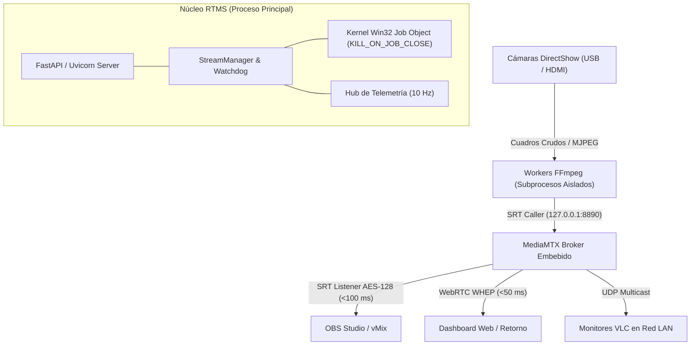

# RTMS — Real-Time Multicam System (Wiki Oficial)

Bienvenido a la **Wiki Técnica y Documentación de Arquitectura de RTMS** (Real-Time Multicam System), una estación de transmisión multicámara de latencia ultrabaja (<100 ms) diseñada específicamente para entornos de producción audiovisual en vivo sobre sistemas Microsoft Windows.

---

## 🧭 Navegación Rápida por Perfil

Selecciona tu rol para acceder directamente a la información pertinente:

| Perfil | Objetivo Primario | Documento Recomendado |
| :--- | :--- | :--- |
| 🎬 **Operador de Producción** | Poner en marcha el sistema, conectar cámaras y enlazar con OBS/vMix | [[Guía de Inicio Rápido\|Guia-de-Inicio-Rapido]] |
| 💻 **Desarrollador / Integrador** | Conocer el bucle de eventos, endpoints REST, WebSockets y modelos de memoria | [[Modelo de Concurrencia e Hilos\|Modelo-de-Concurrencia-e-Hilos]] |
| 🏛️ **Arquitecto de Sistemas** | Evaluar diagramas C4, árboles de decisión técnica y registros formales | [[Vistas C4 del Sistema\|Arquitectura-del-Sistema]] |
| 🛡️ **SysAdmin / Operaciones** | Hardening de procesos en Windows kernel, blindaje Job Objects y runbooks | [[Runbook de Operaciones\|Runbook-y-Operaciones]] |
| 🔧 **Soporte / Troubleshooting** | Resolución de incidentes, colisiones de puertos y pérdidas de cuadros | [[Diagnóstico y Resolución de Incidentes\|Diagnostico-y-Resolucion-de-Incidentes]] |

---

## 🏛️ Arquitectura del Sistema en un Vistazo

RTMS opera bajo un modelo desacoplado donde la interfaz de usuario, el orquestador backend de Python y los procesos de ingesta de hardware se comunican a través de canales de memoria y sockets de loopback locales:

---

## 📚 Mapa Completo de Contenidos

### 1. Arquitectura y Diseño de Sistemas
* **[[Vistas C4 del Sistema|Arquitectura-del-Sistema]]**: Desglose bajo metodología C4 (Contexto de Sistema, Contenedores, Componentes del Núcleo y Pipeline de Código).
* **[[Modelo de Concurrencia e Hilos|Modelo-de-Concurrencia-e-Hilos]]**: Topología multi-hilo (`asyncio` Proactor loop, hilo de System Tray, pools de subprocesos y prevención de deadlocks de tuberías).
* **[[Contratos de Interfaz y Protocolos|Contratos-de-Interfaz-y-Protocolos]]**: Especificación de la API REST, WebSocket de telemetría a 10 Hz, transporte SRT multiplexado, UDP Multicast y tickets efímeros.
* **[[Matriz de Trazabilidad|Matriz-de-Trazabilidad]]**: Matriz bidireccional que vincula cada módulo de código fuente con sus correspondientes ADRs y RFCs.

### 2. Registros de Decisión Arquitectónica (ADRs)
Consulta el **[[Catálogo Completo de ADRs|Catalogo-de-ADRs]]** para analizar las 19 decisiones arquitectónicas formales que sustentan el sistema:
* **ADR-0001**: Adopción de MediaMTX como Broker Central Multiplexor.
* **ADR-0002**: Negociación Dinámica de Formatos DirectShow (MJPEG vs RAW).
* **ADR-0003**: Cifrado Simétrico AES-128 con Passphrase en SRT.
* **ADR-0004**: Verificador Ineludible mediante Reloj Óptico de Código de Barras.
* **ADR-0005**: Distribución UDP Multicast en Rango Canónico 239.255.0.x.
* **ADR-0006**: Desacoplamiento Asíncrono de FastAPI y System Tray.
* **ADR-0007**: Detección y Priorización de Encoders por Hardware (NVENC, QSV, AMF, CPU).
* **ADR-0008**: Sanitización de Datos Sensibles y Descripciones Canónicas en GitHub.
* **ADR-0009**: Blindaje en el Kernel de Windows mediante Win32 Job Objects.
* **ADR-0010**: Persistencia Transaccional con SQLite WAL y Migraciones Idempotentes.
* **ADR-0011**: Cifrado en Reposo de Passphrases mediante Windows DPAPI.
* **ADR-0012**: Prevención de Suspensión del SO, PnPCapabilities y Reloj Kernel a 1 ms.
* **ADR-0013**: Control Estricto de Instancia Única mediante Win32 Named Mutex.
* **ADR-0014**: Coalescencia Single-Flight y Caché TTL en Escaneo DirectShow.
* **ADR-0015**: Hub Reactivo de Telemetría a 10 Hz Activado Bajo Demanda.
* **ADR-0016**: Control de Admisión (Máx 3) y Extracción Binaria SOI/EOI en MJPEG.
* **ADR-0017**: Taxonomía de Errores, FSM y Watchdog con Backoff Exponencial.
* **ADR-0018**: Seguridad con Token URLSafe, Prohibición de Query Params y Parche Proactor.
* **ADR-0019**: Interfaz Nativa de Escritorio WebView2 y Sincronización al System Tray.

### 3. Propuestas Técnicas de Cambio (RFCs)
Consulta el **[[Catálogo Completo de RFCs|Catalogo-de-RFCs]]** con los diseños de ingeniería de los componentes principales:
* **RFC-0001**: Protocolo de Verificación E2E de Latencia y Benchmark Óptico.
* **RFC-0002**: Arquitectura de Distribución Multicámara de Baja Latencia.
* **RFC-0003**: Persistencia Transaccional SQLite WAL y Migrador Idempotente.
* **RFC-0004**: Pipeline de Previsualización Zero-Copy y Tickets Efímeros.
* **RFC-0005**: Blindaje de Procesos con Win32 Job Objects y Ciclo de Vida Resiliente.

### 4. Operaciones, Guías y Mantenimiento
* **[[Guía de Inicio Rápido|Guia-de-Inicio-Rapido]]**: Instalación, arranque y configuración inicial.
* **[[Compatibilidad de Hardware|Compatibilidad-de-Hardware]]**: Dispositivos DirectShow validados, aceleradores GPU y requerimientos de bus USB.
* **[[Runbook de Operaciones|Runbook-y-Operaciones]]**: Puesta en producción, parámetros de red, afinidad de interrupciones, flags de compilación y monitoreo.
* **[[Diagnóstico y Resolución de Incidentes|Diagnostico-y-Resolucion-de-Incidentes]]**: Guía reactiva para operadores y administradores ante contingencias.

---

## ⚡ Enlaces Externos y Recursos del Repositorio

* [Repositorio Principal en GitHub](https://github.com/FJYarsky/RTMS)
* [Descarga de Releases y Binarios Portables](https://github.com/FJYarsky/RTMS/releases)
* [Reporte de Vulnerabilidades e Incidentes](https://github.com/FJYarsky/RTMS/blob/main/SECURITY.md)
* [Historial de Versiones (CHANGELOG)](https://github.com/FJYarsky/RTMS/blob/main/CHANGELOG.md)
* [Licencia del Software (MIT)](https://github.com/FJYarsky/RTMS/blob/main/LICENSE)
