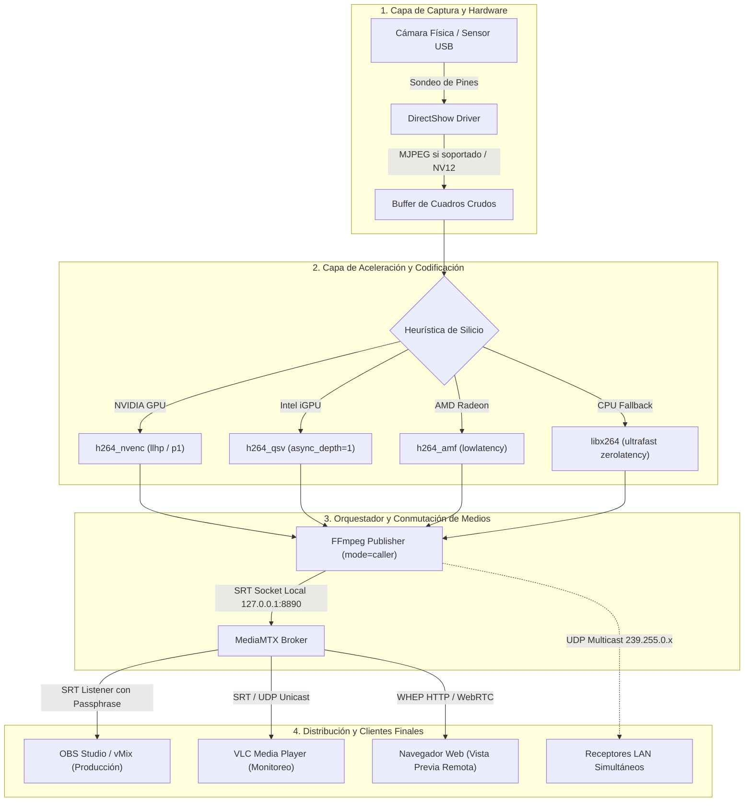

# RFC-0002: Arquitectura de Ingestión, Codificación Concurrente y Distribución Multicámara

* **Estado**: Implementado
* **Fecha de Creación**: 2026-09-25
* **Última Actualización**: 2026-09-30
* **Autor(es)**: Joaquín Yarsky (<joaquinyarsky@gmail.com>)
* **Área / Componente**: Core / Hardware / Pipeline / Network

---

## 1. Resumen Ejecutivo (Abstract)
Este documento especifica la arquitectura del núcleo de procesamiento de video de RTMS, que abarca la detección y negociación de dispositivos de hardware DirectShow, la estrategia de asignación de codificadores acelerados por silicio (NVIDIA NVENC, Intel QSV, AMD AMF, Apple VideoToolbox y fallback CPU), la gestión de procesos concurrentes aislados y la distribución hacia clientes de producción (OBS Studio, vMix, VLC y navegadores WebRTC).

---

## 2. Motivación y Casos de Uso
En producciones audiovisuales en vivo, transmisiones deportivas, conferencias híbridas y eventos con múltiples cámaras, los realizadores enfrentan tres desafíos críticos:
1. **Saturación del Procesador y GPUs**: La codificación simultánea de múltiples señales 1080p sin una asignación inteligente de encoders agota los recursos de la máquina y provoca pérdida de cuadros (*frame drops*).
2. **Cuellos de Botella en el Bus USB**: Conectar 4 o más cámaras a un mismo controlador USB host satura el ancho de banda disponible si no se negocian adecuadamente los pines de compresión del sensor.
3. **Distribución Heterogénea de Clientes**: Una misma producción requiere alimentar la mesa de mezcla (OBS Studio o vMix vía SRT), puestos de control locales (VLC o pantallas vía UDP) y espectadores remotos en navegadores (WebRTC WHEP).

Esta especificación estandariza el pipeline unificado de RTMS para resolver estos retos con latencias inferiores a 500 ms y recuperación automática ante fallos.

---

## 3. Especificación Detallada del Diseño

### 3.1 Diagrama de la Cadena de Ejecución (Execution Pipeline)

---

### 3.2 Especificación de Componentes

#### A. Aislamiento de Procesos de Streaming (`StreamProcess`)
Cada cámara administrada por RTMS está encapsulada en una instancia independiente de ``core/stream_proc.py``:
* **Subproceso Asíncrono Dedicado**: Ejecuta su propia instancia de FFmpeg con pipes de entrada/salida desacoplados.
* **Supervisión de Salud y Reinicio Automático**: Si el controlador de hardware interrumpe la señal, el proceso detecta el fin de flujo y aplica una estrategia de reconexión con retroceso exponencial.
* **Telemetría no Bloqueante**: Lee el stream `progress=pipe:1` de FFmpeg sin consumir ciclos de CPU innecesarios, extrayendo FPS actuales, bitrate de salida, cuadros descartados y tiempo de transmisión.

#### B. Constructor de Comandos Dinámico (`CommandBuilder`)
El módulo ``core/command_builder.py`` compila los argumentos exactos de la línea de comandos de FFmpeg respetando las restricciones de latencia:
1. **Argumentos Globales de Baja Latencia**:
   `-fflags nobuffer+discardcorrupt -flags low_delay -avioflags direct`
2. **Buffer de Recepción de Tiempo Real**:
   `-rtbufsize 65M` (o `100M` en modo MJPEG).
3. **Control de Tasa y Grupos de Imágenes (GOP)**:
   `-g {fps} -keyint_min {fps} -sc_threshold 0` (fuerza un cuadro clave I-Frame exactamente cada 1 segundo para sincronización rápida de clientes sin acumular buffer).

### 3.3 Gestión de Puertos y Colisiones
* **MediaMTX Central**: Escucha por defecto en los puertos:
  - SRT: `8890`
  - WebRTC (WHEP): `8889`
  - API de Control: `9997`
* **Puertos de Cámara Dinámicos**: Administrados por ``core/port_mgr.py``, asegurando que ninguna señal compita por el mismo socket de red.

---

## 4. Consideraciones de Seguridad
* **Cifrado en Capa de Red**: Implementación de cifrado AES-128 nativo en SRT con Passphrase configurable por cámara (especificado en ADR-0003).
* **Control de Acceso a la API REST**: Las rutas administrativas y de control de flujo en ``api/routes/`` validan esquemas de entrada estrictos mediante Pydantic y suprimen cualquier filtración de datos sensibles.

---

## 5. Pruebas y Validación
* Pruebas de orquestación y concurrencia: ``tests/test_stream_lifecycle.py``, ``tests/test_stress_concurrency.py``.
* Verificación E2E de extremo a extremo: ``tests/test_e2e_complete_pipeline.py``.
