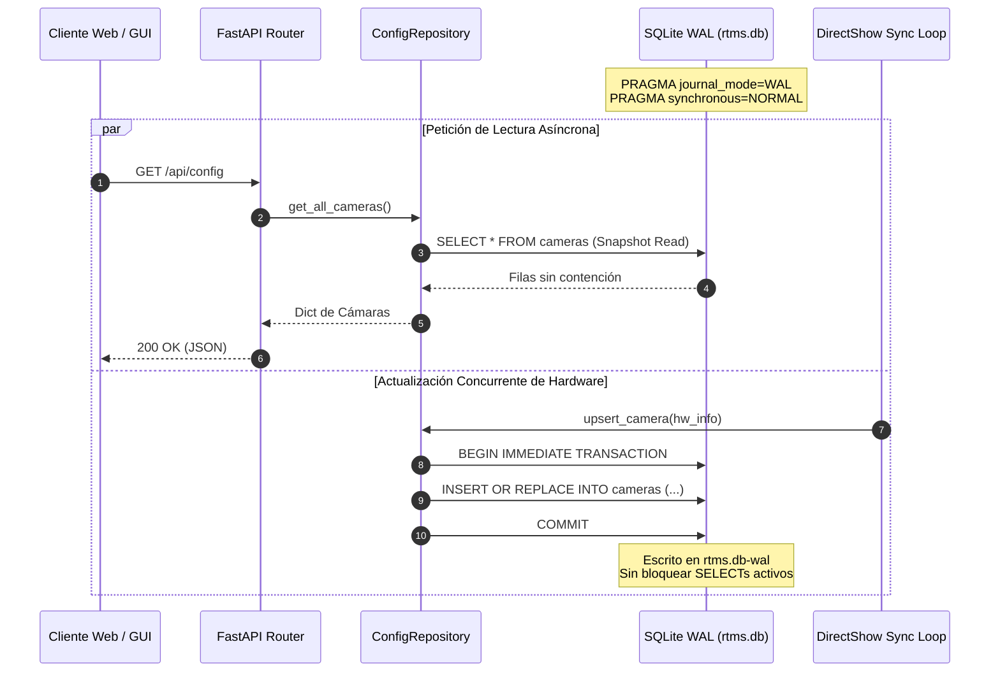

# RFC-0003: Arquitectura de Persistencia Transaccional, Repositorio Asíncrono y Migraciones de Esquema en SQLite WAL

* **Estado**: Implementado
* **Fecha de Creación**: 2026-10-01
* **Última Actualización**: 2026-10-01
* **Autor(es)**: Joaquín Yarsky (<joaquinyarsky@gmail.com>)
* **Área / Componente**: Core / Persistencia / Base de Datos / Concurrencia

---

## 1. Resumen Ejecutivo (Abstract)
Este documento especifica formalmente la arquitectura del motor de almacenamiento y persistencia de RTMS basado en SQLite con registro por adelantado (Write-Ahead Logging - WAL), el patrón Repositorio desacoplado (`ConfigRepository`) y el protocolo de migración atómica y reversible desde esquemas heredados en JSON plano hacia bases de datos relacionales normalizadas. Define el modelo de aislamiento transaccional para operaciones concurrentes entre corrutinas asíncronas de FastAPI y callbacks síncronos del subsistema DirectShow y System Tray, garantizando durabilidad ante caídas intempestivas del sistema operativo.

---

## 2. Motivación y Casos de Uso
El almacenamiento de la configuración en un archivo plano monolítico `config/config.json` generaba vulnerabilidades estructurales en escenarios de misión crítica:
1. **Truncamiento por Caídas de Tensión**: Una interrupción de energía o crash del proceso mientras se ejecutaba `open("config.json", "w").write(...)` dejaba el archivo con 0 bytes, provocando la pérdida irrevocable de las asignaciones de puertos y nombres de cámaras.
2. **Contención y Condiciones de Carrera**: Con el soporte de auto-descubrimiento en caliente (*hotplug*) y múltiples clientes web consumiendo la API simultáneamente, se producían escrituras superpuestas donde la última petición sobreescribía cambios legítimos realizados en paralelo.
3. **Imposibilidad de Transacciones Complejas**: Operaciones atómicas como reasignar puertos colisionados, actualizar el estado de auto-inicio y persistir credenciales cifradas no podían agruparse bajo semántica *All-or-Nothing*.

Esta especificación resuelve estos desafíos mediante la adopción de SQLite WAL, asegurando tolerancia total a fallos y concurrencia lectura/escritura sin bloqueos mutuos.

---

## 3. Especificación Detallada del Diseño (Detailed Design)

### 3.1 Estructura de Datos y Esquema Relacional
La base de datos se aloja en `config/rtms.db` y se estructura bajo el siguiente esquema DDL estricto:

```sql
PRAGMA journal_mode = WAL;
PRAGMA synchronous = NORMAL;
PRAGMA busy_timeout = 5000;
PRAGMA foreign_keys = ON;

-- Tabla de control inmutable de versiones de migración
CREATE TABLE IF NOT EXISTS schema_migrations (
    version INTEGER PRIMARY KEY,
    applied_at TIMESTAMP DEFAULT CURRENT_TIMESTAMP
);

-- Almacén clave-valor para parámetros del sistema operativo y estado global
CREATE TABLE IF NOT EXISTS system_settings (
    key TEXT PRIMARY KEY,
    value TEXT NOT NULL
);

-- Entidad principal de cámaras y configuración de codificación DirectShow
CREATE TABLE IF NOT EXISTS cameras (
    device_path TEXT PRIMARY KEY,
    id TEXT NOT NULL,
    friendly_name TEXT NOT NULL,
    resolution TEXT NOT NULL,
    fps INTEGER NOT NULL,
    bitrate INTEGER NOT NULL,
    encoder TEXT NOT NULL,
    port INTEGER NOT NULL,
    protocol TEXT NOT NULL DEFAULT 'srt',
    srt_latency INTEGER NOT NULL DEFAULT 120,
    srt_passphrase TEXT DEFAULT '',
    zerolatency INTEGER NOT NULL DEFAULT 1,
    auto_start INTEGER NOT NULL DEFAULT 0,
    is_virtual INTEGER NOT NULL DEFAULT 0,
    udp_mode TEXT NOT NULL DEFAULT 'multicast',
    udp_host TEXT NOT NULL DEFAULT '127.0.0.1',
    updated_at TIMESTAMP DEFAULT CURRENT_TIMESTAMP
);

-- Dispositivos excluidos del inventario
CREATE TABLE IF NOT EXISTS ignored_devices (
    device_path TEXT PRIMARY KEY,
    friendly_name TEXT NOT NULL,
    ignored_at TIMESTAMP DEFAULT CURRENT_TIMESTAMP
);
```

### 3.2 Diagrama de Flujo y Secuencia
Flujo de acceso concurrente y desacoplamiento de lecturas y escrituras bajo SQLite WAL:



### 3.3 Algoritmos Clave y Lógica de Migración Idempotente
El algoritmo de migración automática desde `config.json` hacia `rtms.db` se rige por las siguientes etapas deterministas:

1. **Evaluación de Precondición**:
   Se evalúa la condición booleana de migración requerida:
   $$\text{MigracionRequerida} = \text{Existe}(F_{\mathrm{json}}) \land (N_{\mathrm{cameras}} = 0) \land (N_{\mathrm{settings}} = 0)$$
   donde $N_{\mathrm{cameras}}$ representa las filas registradas en la tabla `cameras` y $N_{\mathrm{settings}}$ en `system_settings`.
2. **Creación de Respaldo Inmutable**:
   Antes de abrir cualquier transacción, se copia el archivo original con sufijo de versión:
   `config.json` $\rightarrow$ `config.json.v2.4.1.bak`
3. **Transacción Atómica de Ingestión**:
   Bajo una única transacción de base de datos, se itera sobre la lista de cámaras del JSON y se insertan con normalización de claves y tipos. Si alguna sentencia falla, se ejecuta `ROLLBACK` y el archivo `config.json` permanece intacto.
4. **Verificación Post-Commit**:
   Se confirma que la cantidad de registros insertados en `cameras` coincida con la longitud del arreglo original.

---

## 4. Consideraciones de Rendimiento y Cómputo (Performance & Footprint)
* **Memoria**: El overhead del motor SQLite en modo WAL es menor a 4 MB de memoria RAM.
* **I/O en Disco**:
  - Al utilizar `PRAGMA synchronous = NORMAL` en modo WAL, la base de datos solo invoca `fsync()` durante los puntos de control (*checkpoints*) y no en cada transacción individual, reduciendo el desgaste de unidades SSD NVMe en más de un 80% frente al modo rollback journal tradicional.
  - El parámetro `PRAGMA busy_timeout = 5000` evita excepciones de bloqueo inmediato esperando hasta 5 segundos a que un escritor previo confirme su transacción.

---

## 5. Consideraciones de Seguridad (Security Considerations)
* **Inyección SQL**: El repositorio utiliza exclusivamente consultas parametrizadas (`?` placeholders). Queda estrictamente prohibida la interpolación directa de cadenas en sentencias SQL.
* **Cifrado de Credenciales**: El campo `srt_passphrase` no almacena texto plano; se persiste protegido mediante Windows DPAPI con el prefijo canónico `dpapi:` (conforme a ADR-0011).

---

## 6. Compatibilidad y Migración (Backwards Compatibility)
* Totalmente compatible hacia atrás: los sistemas desplegados con versiones que utilizaban `config.json` son migrados de forma 100% transparente en el primer arranque.
* Si el archivo `rtms.db` es eliminado deliberadamente, el sistema recrea el esquema en la versión actual mediante las migraciones DDL definidas en `database.py`.

---

## 7. Plan de Verificación e Implementación
* **Pruebas de Transaccionalidad**: ``tests/test_config_persistence.py``.
* **Pruebas de Concurrencia Multihilo**: ``tests/test_config_isolation.py``.
* **Pruebas de Integración y Fallos Forzados**: ``tests/test_audit_v260_features.py``.
