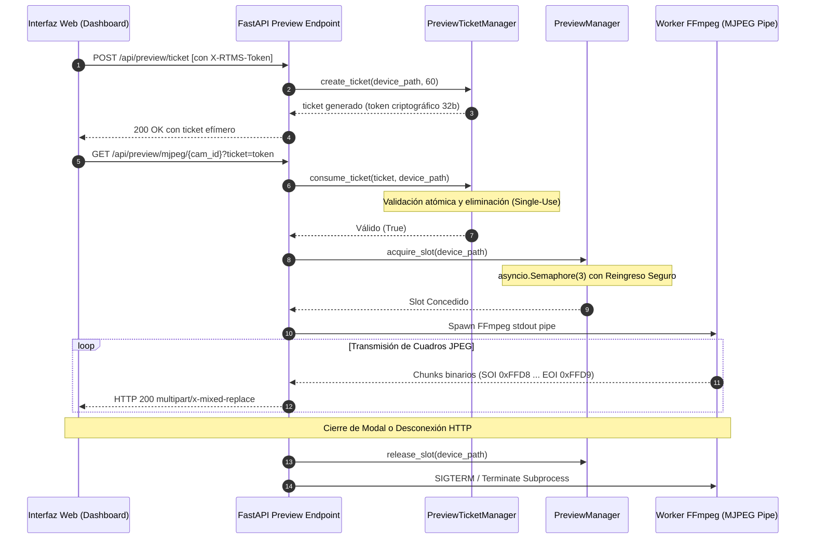
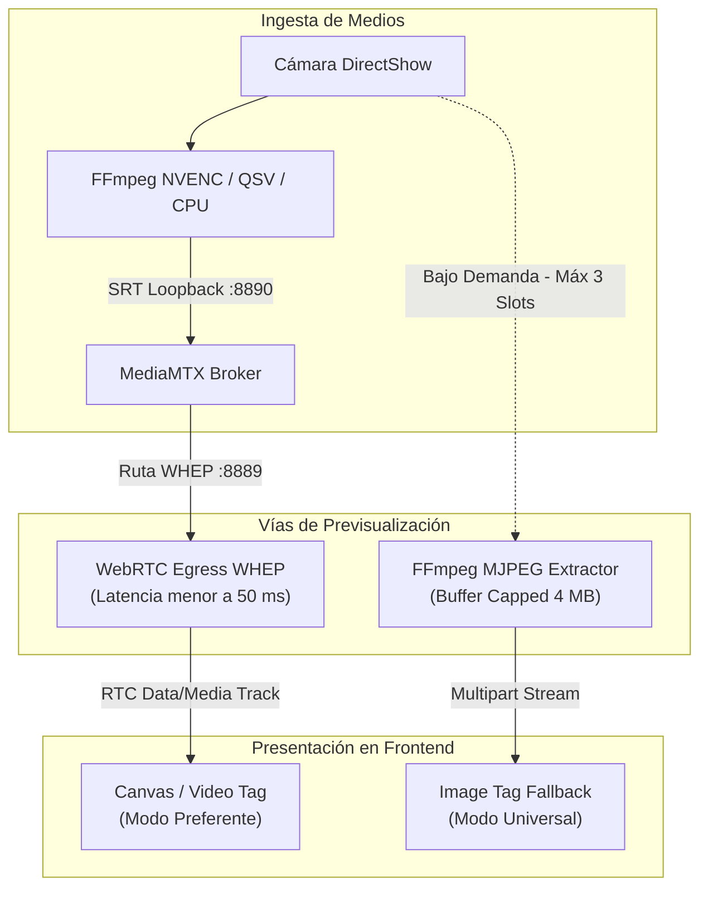

# RFC-0004: Pipeline de Previsualización WebRTC WHEP / MJPEG de Zero-Copy y Control de Admisión Concurrente

* **Estado**: Implementado
* **Fecha de Creación**: 2026-10-01
* **Última Actualización**: 2026-10-01
* **Autor(es)**: Joaquín Yarsky (<joaquinyarsky@gmail.com>)
* **Área / Componente**: Core / Video Pipeline / HTTP / WebSockets / Preview

---

## 1. Resumen Ejecutivo (Abstract)
Este documento especifica la arquitectura del subsistema de previsualización en vivo bajo demanda de RTMS. Establece un mecanismo dual compuesto por:
1. Un pipeline de ultra-baja latencia (<50 ms) basado en WebRTC WHEP (WebRTC HTTP Egress Protocol) retransmitido directamente por el broker central MediaMTX sin re-codificación.
2. Un canal de fallback universal basado en HTTP Multipart MJPEG (`multipart/x-mixed-replace`), gobernado por tickets criptográficos efímeros de un solo uso (`PreviewTicketManager`), semáforos de control de admisión concurrente (`asyncio.Semaphore(3)`) y un extractor binario de fragmentos JPEG delimitado por cabeceras SOI/EOI con cota superior de memoria de 4 MB.

---

## 2. Motivación y Casos de Uso
En estaciones de producción audiovisual multicámara, el operador requiere auditar la señal física de cualquier cámara antes o durante la transmisión sin alterar el flujo de producción que alimenta a OBS Studio o vMix. Los requerimientos operativos clave son:
1. **Aislamiento Total de la Emisión**: Abrir o cerrar una vista previa en la interfaz jamás debe reiniciar la cámara física ni provocar pérdida de paquetes en el stream SRT/UDP principal.
2. **Cero Consumo en Estado Inactivo**: Cuando ningún operador tiene un modal o vista previa abierta, el uso de CPU y GPU dedicado a la previsualización debe ser exactamente 0%.
3. **Compatibilidad con Cualquier Navegador**: WebRTC ofrece la latencia más baja pero puede fallar en redes corporativas con políticas restrictivas de UDP o proxies corporativos; se requiere un fallback HTTP nativo que funcione dentro de cualquier etiqueta `` estándar.
4. **Protección contra Denegación de Servicio (DoS)**: Evitar que múltiples clientes o pestañas concurrentes agoten los decodificadores de video o la memoria del sistema.

---

## 3. Especificación Detallada del Diseño (Detailed Design)

### 3.1 Estructura de Datos y Flujo de Tickets Efímeros
Para permitir la inserción segura de flujos de video en etiquetas HTML `` (donde el navegador no permite inyectar cabeceras personalizadas de autenticación `X-RTMS-Token`), se establece el protocolo de tickets efímeros:

### 3.2 Diagrama de Arquitectura de Vistas Previas Dúplex

### 3.3 Algoritmos Clave y Lógica Matemática de Delimitación Binaria
El algoritmo de desempaquetado de cuadros JPEG en memoria implementa una máquina de estados binaria sobre fragmentos de 32 KB:

1. **Definición de Marcadores JPEG**:
   - $\mathrm{SOI} = \texttt{0xFFD8}$ (Start of Image).
   - $\mathrm{EOI} = \texttt{0xFFD9}$ (End of Image).
2. **Algoritmo de Detección de Límites**:
   Sea $B$ el acumulador en memoria. En cada lectura de fragmento $c \leftarrow \text{stream.read}(32768)$:
   $$B \leftarrow B \mathbin{\Vert} c$$
   Si $\text{longitud}(B) > B_{\mathrm{max}}$ (donde $B_{\mathrm{max}} = 4 \times 1024 \times 1024\text{ bytes} = 4\text{ MB}$ por `MAX_JPEG_BUFFER`):
   se trunca el buffer al margen de seguridad ($B \leftarrow B[-65536:]$) emitiendo una advertencia de desbordamiento en el log.
   
   Se buscan las posiciones de los marcadores:
   $$p_{\mathrm{soi}} = \mathrm{find}(B, \mathrm{SOI}), \quad p_{\mathrm{eoi}} = \mathrm{find}(B[p_{\mathrm{soi}}:], \mathrm{EOI}) + p_{\mathrm{soi}} + 2$$
   Si $p_{\mathrm{soi}} \neq -1 \land p_{\mathrm{eoi}} > p_{\mathrm{soi}}$:
   $$\text{Cuadro} = B[p_{\mathrm{soi}} : p_{\mathrm{eoi}}]$$
   $$B \leftarrow B[p_{\mathrm{eoi}}:]$$
   Se emite el encabezado de bloque MIME y los bytes del cuadro inmediatamente.

---

## 4. Consideraciones de Rendimiento y Cómputo (Performance & Footprint)
* **Semáforo de Admisión**: Se fija en `MAX_CONCURRENT_PREVIEWS = 3`. Con 3 instancias de previsualización 720p activas, el consumo de CPU adicional se limita a <8% en hardware de gama media.
* **Consumo de Memoria**: La cota de 4 MB por buffer evita fugas de memoria o acumulación de tramas ante ralentizaciones de red del cliente.
* **Recolección Determinista**: Si el cliente cierra el modal o la conexión TCP se interrumpe, el generador asíncrono sale del bucle mediante `GeneratorExit`, liquidando el proceso de FFmpeg en menos de 100 ms.

---

## 5. Consideraciones de Seguridad (Security Considerations)
* **Tickets Efímeros de Un Solo Uso**:
  - Cada ticket se genera mediante generador criptográficamente fuerte (`secrets.token_urlsafe(32)`).
  - Al validarse, se elimina inmediatamente del registro (`pop`), impidiendo que un tercero repita la petición.
  - Expiración incondicional a los 60 segundos si no fue consumido.
* **Límite de Tickets en Memoria**:
  - Máximo 100 tickets activos simultáneos; si se supera el umbral, se desaloja automáticamente el ticket más antiguo para prevenir saturación de memoria RAM.

---

## 6. Compatibilidad y Migración (Backwards Compatibility)
* Provee soporte transparente para navegadores antiguos que no soportan WebRTC mediante el fallback dinámico a MJPEG.
* Totalmente compatible con reproductores de escritorio como FFplay y VLC mediante la API `/api/preview/ffplay`.

---

## 7. Plan de Verificación e Implementación
* **Pruebas de Semáforo y Concurrencia**: ``tests/test_preview.py``.
* **Pruebas de Seguridad y Tickets**: ``tests/test_audit_preview.py``.
* **Pruebas de Robustez de Buffer Binario**: ``tests/test_audit_v270_features.py``.
